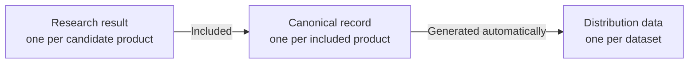

# Data model

The Z Mount Product Database maintains the lens and related optical product dataset separately from the mount adapter dataset.
Within each dataset, data moves through three stages from candidate research to public distribution: research results, canonical records, and distribution data.
On this page, "dataset" means a collection grouped by product scope.
"Research result," "canonical record," and "distribution data" identify the stages from candidate research to distribution.

## Overview

### Datasets by product scope

The two datasets differ in scope and in the structure used for product-specific information.
Distribution data is also generated separately for each dataset.

| Dataset | Product scope | Distribution data |
| --- | --- | --- |
| Lens and related optical product dataset | Photographic lenses, cinema lenses, teleconverters, and pinholes | Lens Full and Lens Light |
| Mount adapter dataset | Products whose primary purpose is adapting another interchangeable-lens mount to the Nikon Z mount | Mount adapter Full |

### Composite product key

Use the combination of a dataset namespace and `id` to identify a product uniquely.

| Distribution | Namespace | Composite key |
| --- | --- | --- |
| Lens Full | `lenses` | `("lenses", id)` |
| Lens Light | `lenses` | `("lenses", id)` |
| Mount adapter Full | `adapters` | `("adapters", id)` |

Lens Full and Lens Light represent the same product collection, so they share the `lenses` namespace and product IDs.
An `id` is unique within its namespace.
The same `id` may be used in different namespaces.
When you combine multiple datasets, use the composite key instead of a bare `id` as the primary key.

The namespace is not an additional field in the JSON.
Determine it from the distribution file that contains the record.
An `id` is a human-readable slug formed from the brand or product name, using lowercase letters and digits separated by hyphens.
The relationship between words in the slug and product information is not part of the public data contract.
Do not parse the brand, product name, specifications, or product type from `id`; use the corresponding fields instead.

The canonical record examples show `id`, `identity`, `lifecycle`, and `officialProductPages` as common basic fields.
Product-specific information uses different structures, and separate JSON Schemas validate research results and canonical records for each dataset.

### From research result to distribution data

Both datasets have one research result for each candidate product.
A research result records the inclusion decision and the sources used as evidence.
Create a canonical record for a product with an included decision, then generate distribution data for that dataset automatically from its canonical records.



The following example shows how the research result, canonical record, and distribution entry for the NIKKOR Z 24-70mm f/2.8 S II relate to one another.
Each JSON example contains only the fields and array entries needed for the explanation and is not a complete file.
The distribution example is fixed to data version `2026.10.09`.
The current file under `dist/` may contain different values because it is updated over time.

=== "Research result"

    A research result records its inclusion decision under `decision`.
    This product has the `included` value under `decision.status`.
    `recordId` refers to the `id` of its canonical record.

    Source: `research/results/lenses/nikkor/nikkor-z-24-to-70mm-f2p8-s-ii.json`

    ```json
    {
      "id": "nikkor-z-24-to-70mm-f2p8-s-ii",
      "decision": {
        "status": "included",
        "recordId": "nikkor-z-24-to-70mm-f2p8-s-ii"
      }
    }
    ```

=== "Canonical record"

    A canonical record contains product information verified against sources.
    `$schema` refers to the JSON Schema used to validate the canonical record.

    Source: `data/records/lenses/nikkor/nikkor-z-24-to-70mm-f2p8-s-ii.json`

    ```json
    {
      "$schema": "../../../../schemas/lenses/product-record.schema.json",
      "id": "nikkor-z-24-to-70mm-f2p8-s-ii",
      "productType": "lens",
      "identity": {
        "manufacturerId": "nikon",
        "brandId": "nikkor",
        "productName": "NIKKOR Z 24-70mm f/2.8 S II"
      },
      "lifecycle": {
        "announcementDate": "2025-08-22"
      },
      "officialProductPages": [
        {
          "url": "https://nij.nikon.com/products/lineup/nikkor/zmount/nikkor_z_24-70mm_f28_s_2/"
        }
      ],
      "mount": {
        "systemId": "nikon-z"
      },
      "lens": {
        "focalLength": {
          "kind": "zoom",
          "rangeMm": {
            "minimum": 24,
            "maximum": 70
          }
        },
        "opticalConstruction": {
          "groups": 10,
          "elements": 14
        }
      }
    }
    ```

=== "Distribution data"

    Lens Full removes the per-product `$schema` and combines the canonical records for lenses and related optical products in the `products` array.
    At the root, `dataVersion` is the data version, `datasetVariant` identifies Full or Light, and `recordCount` is the number of included products.

    Source: `dist/z-mount-lenses.full.json`

    ```json
    {
      "dataVersion": "2026.10.09",
      "datasetVariant": "full",
      "recordCount": 611,
      "referenceData": {
        "manufacturers": {
          "nikon": { "name": "Nikon" }
        },
        "brands": {
          "nikkor": { "name": "NIKKOR" }
        },
        "mountSystems": {
          "nikon-z": { "name": "Nikon Z" }
        }
      },
      "products": [
        {
          "id": "nikkor-z-24-to-70mm-f2p8-s-ii",
          "productType": "lens",
          "identity": {
            "manufacturerId": "nikon",
            "brandId": "nikkor",
            "productName": "NIKKOR Z 24-70mm f/2.8 S II"
          },
          "physical": {
            "weightMeasurements": [
              {
                "grams": 675
              }
            ]
          },
          "controls": [
            {
              "type": "focus-ring",
              "quantity": 1
            }
          ],
          "accessories": {
            "lensHoods": [
              {
                "relationship": "supplied",
                "modelNumberOptions": [
                  "HB-117"
                ],
                "quantity": 1
              }
            ]
          },
          "lens": {
            "focalLength": {
              "kind": "zoom",
              "rangeMm": {
                "minimum": 24,
                "maximum": 70
              }
            },
            "opticalConstruction": {
              "groups": 10,
              "elements": 14
            }
          }
        }
      ]
    }
    ```

Within the `lenses` namespace in this example, `decision.recordId` in the research result, `id` in the canonical record, and `id` in the distribution entry all match.
This matching ID makes it possible to trace the same product through all three stages.

`PRODUCTS.md`, the product list, is generated automatically from research results and canonical records separately from the distribution data.

## Lenses and related optical products

`productType` is one of `lens`, `teleconverter`, or `pinhole`.
Product-specific specifications are recorded in the product-type block with the same name as `productType`.
For the NIKKOR Z 24-70mm f/2.8 S II, that block is `lens`.

### Lens Full and Lens Light

Lens Light contains the same products in the same order as Lens Full and uses the same product IDs.
It retains the fields needed for the existing website display, but it does not add Light-only values.
Each retained value and its data type match Lens Full.
The only exception is that `minimumFocusDistances` retains only the entries tied for the shortest focus distance, while `reproductionMagnifications` retains only the entries tied for the greatest reproduction ratio, as described under [Value-state rules](value-rules.md).

In the NIKKOR Z 24-70mm f/2.8 S II example above, Lens Full contains the 675 g weight, 24-70 mm focal length, optical construction, controls, and accessories.
For this example, Lens Light retains the weight and focal length but omits the optical construction, controls, and accessories.

| Information | Lens Full | Lens Light |
| --- | --- | --- |
| Product ID | `nikkor-z-24-to-70mm-f2p8-s-ii` | `nikkor-z-24-to-70mm-f2p8-s-ii` |
| Weight | `675 g` | `675 g` |
| Focal length | `24-70 mm` | `24-70 mm` |
| Optical construction | 10 groups, 14 elements | Field omitted |
| Controls | Included under `controls` | Field omitted |
| Accessories | Included under `accessories` | Field omitted |

## Mount adapters

Mount adapters also use research results to record inclusion decisions and have a canonical record for each included product.
Their canonical record structure differs from the structure for lenses and related optical products and has neither `productType` nor a product-type block.

=== "Canonical record"

    For the Mount Adapter FTZ II, `mountConfigurations` records Nikon F on the lens side and Nikon Z on the camera side.

    Source: `data/records/adapters/nikon/mount-adapter-ftz-ii.json`

    ```json
    {
      "$schema": "../../../../schemas/adapters/adapter-record.schema.json",
      "id": "mount-adapter-ftz-ii",
      "identity": {
        "manufacturerId": "nikon",
        "brandId": "nikon",
        "productName": "Mount Adapter FTZ II"
      },
      "lifecycle": {
        "announcementDate": "2021-10-28"
      },
      "officialProductPages": [
        {
          "url": "https://nij.nikon.com/products/lineup/accessory/body/ftz_2/index.html"
        }
      ],
      "mountConfigurations": [
        {
          "lensSideMountSystemId": "nikon-f",
          "cameraSideMountSystemId": "nikon-z",
          "lensRetention": null,
          "lensRearProtrusionLimits": null
        }
      ],
      "electronics": {
        "electronicContacts": true,
        "autofocus": true,
        "metadataTransmission": {
          "present": true,
          "standards": [
            "exif"
          ]
        }
      },
      "electronicServices": null,
      "conversionOptics": {
        "present": false
      },
      "mechanisms": [],
      "physical": {
        "weightMeasurements": [
          {
            "grams": 125,
            "approximate": true,
            "conditions": {}
          }
        ]
      }
    }
    ```

=== "Distribution data"

    Mount adapter Full combines canonical records in the `adapters` array.
    Its root metadata uses the same fields as Lens Full.

    Source: `dist/z-mount-adapters.full.json`

    ```json
    {
      "dataVersion": "2026.10.09",
      "datasetVariant": "full",
      "recordCount": 447,
      "referenceData": {
        "manufacturers": {
          "nikon": { "name": "Nikon" }
        },
        "brands": {
          "nikon": { "name": "Nikon" }
        },
        "mountSystems": {
          "nikon-f": { "name": "Nikon F" },
          "nikon-z": { "name": "Nikon Z" }
        }
      },
      "adapters": [
        {
          "id": "mount-adapter-ftz-ii",
          "identity": {
            "manufacturerId": "nikon",
            "brandId": "nikon",
            "productName": "Mount Adapter FTZ II"
          },
          "mountConfigurations": [
            {
              "lensSideMountSystemId": "nikon-f",
              "cameraSideMountSystemId": "nikon-z",
              "lensRetention": null,
              "lensRearProtrusionLimits": null
            }
          ]
        }
      ]
    }
    ```

The `id` for the Mount Adapter FTZ II matches between its canonical record and its entry in Mount adapter Full.
There is no Light distribution for mount adapters.

## Shared registries {#shared-registries}

The registries map manufacturer, brand, and mount-system IDs to display names.
Both datasets use the same manufacturer and brand registry and the same mount-system registry.

Manufacturer and brand registry: `data/product-manufacturer-brand-registry.json`

Mount-system registry: `data/mount-system-registry.json`

| Product | Manufacturer ID | Brand ID | Mount-system ID |
| --- | --- | --- | --- |
| NIKKOR Z 24-70mm f/2.8 S II | `nikon` | `nikkor` | `nikon-z` |
| Mount Adapter FTZ II | `nikon` | `nikon` | Lens side: `nikon-f`<br>Camera side: `nikon-z` |

Canonical records store registered IDs in `identity.manufacturerId` and `identity.brandId`.
The parent directory of a canonical record is the same brand ID as `identity.brandId`.
Research results use the same IDs in `subject.manufacturerId` and `subject.brandId`; when the brand is not established, `subject.brandId` is `null` and the result is placed under `unattributed/`.
Lenses and related optical products use mount-system IDs in `mount.systemId` and, for a supplied or dedicated adapter, `mount.adapter.nativeMountSystemId`. Mount adapters use mount-system IDs in `mountConfigurations`.

The two source registries support research, authoring, validation, and distribution generation.
Before the first release, a source registry contains only entries referenced by canonical records or research results.
Manufacturer and brand usage includes references from research results with any decision: included, excluded, or needs review.
Brand usage also includes brand IDs recorded in canonical alternate names.
Mount-system usage comes from canonical records.
Their structure is validated by repository-only JSON Schemas under `schemas/internal/`.
They are not separate distribution files.
Each distributed JSON instead embeds only the referenced entries in a root `referenceData` object.
For example, a consumer can resolve `product.identity.brandId` through `referenceData.brands[brandId].name`.
Each `referenceData` entry is currently an object containing only `name`.
This shape allows future display metadata to be added without replacing a string value with an object.

Manufacturer, brand, and mount-system IDs become fixed on their first appearance in an official GitHub Release asset, even if a display name later changes.
Published IDs are not renamed or reused.
If a published ID later becomes unreferenced, this stability rule takes precedence.
When that first occurs, add a mechanism that retains and validates the published ID explicitly.

## File layout

Each dataset has directories for its research results and canonical records.
Create one research result file for each candidate product and one canonical record file for each included product.

```text
.
├── research/results/
│   ├── lenses/<brand-directory>/<result-id>.json
│   └── adapters/<brand-directory>/<result-id>.json
├── data/
│   ├── records/
│   │   ├── lenses/<brand-id>/<product-id>.json
│   │   └── adapters/<brand-id>/<adapter-id>.json
│   ├── product-manufacturer-brand-registry.json
│   └── mount-system-registry.json
├── schemas/
│   ├── shared/
│   ├── lenses/
│   ├── adapters/
│   └── internal/
├── dist/
│   ├── z-mount-lenses.full.json
│   ├── z-mount-lenses.light.json
│   └── z-mount-adapters.full.json
└── PRODUCTS.md
```

Use a brand ID or `unattributed` for `<brand-directory>` in the research result path.

!!! warning "Do not edit generated files directly"
    Distribution data under `dist/` is generated automatically from canonical records.
    The product list, `PRODUCTS.md`, is generated from research results and canonical records.
    Update the research result or canonical record that contains the source information, then run the generation process.

## Related pages

- [Research result structure and inclusion decisions](research.md)
- [Field reference for lenses and related optical products](lens-field-reference.md)
- [Mount adapter field reference](adapter-field-reference.md)
- [JSON Schema types and constraints](reference/schemas/index.md)
- [Value-state rules](value-rules.md)
- [Retrieve and load distribution data](use-data.md)
