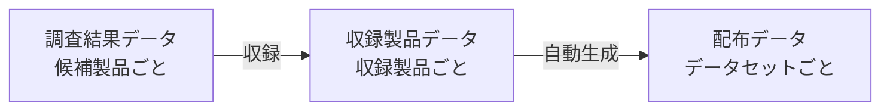

# データモデル

Z Mount Product Databaseは、レンズと関連光学製品のデータセットと、マウントアダプターのデータセットを別々に管理します。
各データセットでは、候補製品の調査から利用者向けの配布までを、調査結果データ、収録製品データ、配布データの三段階に分けます。
このページでは、収録対象ごとのまとまりを「データセット」と呼びます。
「調査結果データ」「収録製品データ」「配布データ」は、候補製品の調査から配布までの各段階を表します。

## 全体像

### 収録対象ごとのデータセット

二つのデータセットは、収録対象と、製品固有の情報を記録する構造が異なります。
配布データもデータセットごとに生成します。

| データセット | 収録対象 | 配布データ |
| --- | --- | --- |
| レンズと関連光学製品のデータセット | 写真用レンズ、シネマ用レンズ、テレコンバーター、ピンホール | レンズFull版、レンズLight版 |
| マウントアダプターのデータセット | 他の交換レンズマウントからZマウントへの変換を主目的とする製品 | マウントアダプターFull版 |

### 製品を識別する複合キー

製品を一意に識別するには、データセットの名前空間（namespace）と`id`の複合キーを使います。

| 配布データ | 名前空間 | 複合キー |
| --- | --- | --- |
| レンズFull版 | `lenses` | `("lenses", id)` |
| レンズLight版 | `lenses` | `("lenses", id)` |
| マウントアダプターFull版 | `adapters` | `("adapters", id)` |

レンズFull版とLight版は同じ製品集合を表すため、`lenses`名前空間と製品IDを共有します。
`id`は名前空間内で一意です。
異なる名前空間では同じ`id`を使用できます。
複数のデータセットをまとめる場合は、`id`単体を主キーにせず、この複合キーを使用してください。

名前空間はJSON内の追加フィールドではありません。
取得した配布ファイルの種類から判定します。
`id`は、ブランド名や製品名をもとに、小文字英数字をハイフンで区切った、人が読めるスラッグ形式のIDです。
ただし、スラッグ内の語と製品情報との対応関係は、公開データの仕様に含めません。
ブランド、製品名、仕様、製品種別は`id`から解析せず、それぞれの専用フィールドを使用します。

収録製品データのJSON例には、共通する基本項目として`id`、`identity`、`lifecycle`、`officialProductPages`を掲載しています。
製品固有の情報は異なる構造に記録し、調査結果データと収録製品データは、それぞれデータセット別のJSON Schemaで検証します。

### 調査結果データから配布データまで

どちらのデータセットでも、候補製品ごとに調査結果データを作成します。
調査結果データには、収録判断と、その根拠として使った情報源を記録します。
「収録」と判断した製品には収録製品データを作成し、そこからデータセットごとの配布データを自動生成します。



NIKKOR Z 24-70mm f/2.8 S IIを例に、調査結果データ、収録製品データ、配布データのつながりを示します。
このページに掲載するJSONは、実際のファイルから説明に必要な項目や配列の要素だけを抜き出したもので、いずれも完全なファイルではありません。
配布データの例は、データバージョン `2026.09.20` の内容を固定して掲載しています。
参照元として示す `dist/` の現行ファイルは更新されるため、掲載値と異なる場合があります。

=== "調査結果データ"

    調査結果データでは、収録判断を`decision`に記録します。
    この製品の`decision.status`は、収録を表す`included`です。
    `recordId`は、収録製品データの`id`を指しています。

    参照元：`research/results/lenses/nikkor/nikkor-z-24-to-70mm-f2p8-s-ii.json`

    ```json
    {
      "id": "nikkor-z-24-to-70mm-f2p8-s-ii",
      "decision": {
        "status": "included",
        "recordId": "nikkor-z-24-to-70mm-f2p8-s-ii"
      }
    }
    ```

=== "収録製品データ"

    収録製品データには、情報源で確認した製品情報を記録します。
    `$schema`は、収録製品データの検証に使うJSON Schemaを指します。

    参照元：`data/records/lenses/nikkor/nikkor-z-24-to-70mm-f2p8-s-ii.json`

    ```json
    {
      "$schema": "../../../../schemas/lenses/product-record.schema.json",
      "id": "nikkor-z-24-to-70mm-f2p8-s-ii",
      "productType": "lens",
      "identity": {
        "manufacturerId": "nikon",
        "brandId": "nikkor",
        "productName": "NIKKOR Z 24-70mm f/2.8 S II"
      },
      "lifecycle": {
        "announcementDate": "2025-08-22"
      },
      "officialProductPages": [
        {
          "url": "https://nij.nikon.com/products/lineup/nikkor/zmount/nikkor_z_24-70mm_f28_s_2/"
        }
      ],
      "mount": {
        "systemId": "nikon-z"
      },
      "lens": {
        "focalLength": {
          "kind": "zoom",
          "rangeMm": {
            "minimum": 24,
            "maximum": 70
          }
        },
        "opticalConstruction": {
          "groups": 10,
          "elements": 14
        }
      }
    }
    ```

=== "配布データ"

    レンズFull版では、製品ごとの`$schema`を除き、レンズと関連光学製品の収録製品データを`products`配列にまとめます。
    ルートの`dataVersion`はデータバージョン、`datasetVariant`はFull版かLight版か、`recordCount`は収録製品数を表します。

    参照元：`dist/z-mount-lenses.full.json`

    ```json
    {
      "dataVersion": "2026.09.20",
      "datasetVariant": "full",
      "recordCount": 606,
      "referenceData": {
        "manufacturers": {
          "nikon": { "name": "Nikon" }
        },
        "brands": {
          "nikkor": { "name": "NIKKOR" }
        },
        "mountSystems": {
          "nikon-z": { "name": "Nikon Z" }
        }
      },
      "products": [
        {
          "id": "nikkor-z-24-to-70mm-f2p8-s-ii",
          "productType": "lens",
          "identity": {
            "manufacturerId": "nikon",
            "brandId": "nikkor",
            "productName": "NIKKOR Z 24-70mm f/2.8 S II"
          },
          "physical": {
            "weightMeasurements": [
              {
                "grams": 675
              }
            ]
          },
          "controls": [
            {
              "type": "focus-ring",
              "quantity": 1
            }
          ],
          "accessories": {
            "lensHoods": [
              {
                "relationship": "supplied",
                "modelNumberOptions": [
                  "HB-117"
                ],
                "quantity": 1
              }
            ]
          },
          "lens": {
            "focalLength": {
              "kind": "zoom",
              "rangeMm": {
                "minimum": 24,
                "maximum": 70
              }
            },
            "opticalConstruction": {
              "groups": 10,
              "elements": 14
            }
          }
        }
      ]
    }
    ```

この例では、`lenses`名前空間内で、調査結果データの`decision.recordId`、収録製品データの`id`、配布データ内の`id`がすべて一致します。
このIDの一致により、三段階で同じ製品を追跡できます。

配布データとは別に、調査結果データと収録製品データから製品一覧 `PRODUCTS.md` を自動生成します。

## レンズと関連光学製品

`productType`には、`lens`、`teleconverter`、`pinhole`のいずれかを記録します。
製品固有の仕様は、`productType`と同名の製品種別ブロックに記録します。
NIKKOR Z 24-70mm f/2.8 S IIでは、`lens`ブロックがこれに当たります。

### レンズFull版とレンズLight版

レンズLight版には、レンズFull版と同じ製品を同じ順序で収録し、製品IDも共通です。
各製品から既存Web表示に必要な項目を残しますが、Light版だけの値は追加しません。
残した個々の値とデータ型は、レンズFull版と一致します。
ただし、最短撮影距離と最大撮影倍率の配列では、[値の読み方](value-rules.md)で定めた条件に合う要素だけをFull版から残します。

掲載したNIKKOR Z 24-70mm f/2.8 S IIのJSON例では、レンズFull版に重量の675 g、焦点距離の24–70 mm、レンズ構成、操作部、付属品が含まれます。
この例のレンズLight版では、重量と焦点距離を残し、レンズ構成、操作部、付属品を省略します。

| 内容 | レンズFull版 | レンズLight版 |
| --- | --- | --- |
| 製品ID | `nikkor-z-24-to-70mm-f2p8-s-ii` | `nikkor-z-24-to-70mm-f2p8-s-ii` |
| 重量 | `675 g` | `675 g` |
| 焦点距離 | `24–70 mm` | `24–70 mm` |
| レンズ構成 | `10群14枚` | 項目を省略 |
| 操作部 | `controls`に収録 | 項目を省略 |
| 付属品 | `accessories`に収録 | 項目を省略 |

## マウントアダプター

マウントアダプターでも、調査結果データに収録判断を記録し、「収録」と判断した製品には収録製品データを作成します。
ただし、収録製品データの構造はレンズと関連光学製品とは異なり、`productType`と製品種別ブロックがありません。

=== "収録製品データ"

    マウントアダプター FTZ IIでは、変換元のNikon Fとカメラ側のNikon Zを`mountConfigurations`に記録します。

    参照元：`data/records/adapters/nikon/mount-adapter-ftz-ii.json`

    ```json
    {
      "$schema": "../../../../schemas/adapters/adapter-record.schema.json",
      "id": "mount-adapter-ftz-ii",
      "identity": {
        "manufacturerId": "nikon",
        "brandId": "nikon",
        "productName": "Mount Adapter FTZ II"
      },
      "lifecycle": {
        "announcementDate": "2021-10-28"
      },
      "officialProductPages": [
        {
          "url": "https://nij.nikon.com/products/lineup/accessory/body/ftz_2/index.html"
        }
      ],
      "mountConfigurations": [
        {
          "lensSideMountSystemId": "nikon-f",
          "cameraSideMountSystemId": "nikon-z",
          "lensRetention": null,
          "lensRearProtrusionLimits": null
        }
      ],
      "electronics": {
        "electronicContacts": true,
        "autofocus": true,
        "metadataTransmission": {
          "present": true,
          "standards": [
            "exif"
          ]
        }
      },
      "electronicServices": null,
      "conversionOptics": {
        "present": false
      },
      "mechanisms": [],
      "physical": {
        "weightMeasurements": [
          {
            "grams": 125,
            "approximate": true,
            "conditions": {}
          }
        ]
      }
    }
    ```

=== "配布データ"

    マウントアダプターFull版では、収録製品データを`adapters`配列にまとめます。
    ルートのメタデータはレンズFull版と同じ項目を使います。

    参照元：`dist/z-mount-adapters.full.json`

    ```json
    {
      "dataVersion": "2026.09.20",
      "datasetVariant": "full",
      "recordCount": 445,
      "referenceData": {
        "manufacturers": {
          "nikon": { "name": "Nikon" }
        },
        "brands": {
          "nikon": { "name": "Nikon" }
        },
        "mountSystems": {
          "nikon-f": { "name": "Nikon F" },
          "nikon-z": { "name": "Nikon Z" }
        }
      },
      "adapters": [
        {
          "id": "mount-adapter-ftz-ii",
          "identity": {
            "manufacturerId": "nikon",
            "brandId": "nikon",
            "productName": "Mount Adapter FTZ II"
          },
          "mountConfigurations": [
            {
              "lensSideMountSystemId": "nikon-f",
              "cameraSideMountSystemId": "nikon-z",
              "lensRetention": null,
              "lensRearProtrusionLimits": null
            }
          ]
        }
      ]
    }
    ```

収録製品データとマウントアダプターFull版では、マウントアダプター FTZ IIの`id`が一致します。
マウントアダプターにLight版はありません。

## 共通レジストリ {#shared-registries}

レジストリは、メーカー、ブランド、マウントシステムのIDと表示名を対応付けます。
どちらのデータセットも、同じメーカーとブランドのレジストリと、同じマウントシステムのレジストリを参照します。

メーカーとブランドの参照元：`data/product-manufacturer-brand-registry.json`

マウントシステムの参照元：`data/mount-system-registry.json`

| 製品 | メーカーID | ブランドID | マウントシステムID |
| --- | --- | --- | --- |
| NIKKOR Z 24-70mm f/2.8 S II | `nikon` | `nikkor` | `nikon-z` |
| マウントアダプター FTZ II | `nikon` | `nikon` | レンズ側：`nikon-f`<br>カメラ側：`nikon-z` |

収録製品データの`identity.manufacturerId`と`identity.brandId`には、レジストリに登録されたIDを記録します。
収録製品データの親ディレクトリには`identity.brandId`と同じブランドIDを使います。
調査結果データの`subject.manufacturerId`と`subject.brandId`にも同じIDを使いますが、ブランドを確認できない候補製品は`subject.brandId`を`null`にして`unattributed/`へ置きます。
レンズと関連光学製品の`mount.systemId`、同梱または専用アダプターの`mount.adapter.nativeMountSystemId`、マウントアダプターの`mountConfigurations`には、マウントシステムIDを記録します。

二つの基準レジストリは、調査、データ作成、検証、配布データ生成に使用します。
公開前の基準レジストリには、収録製品データまたは調査結果データから参照される項目だけを置きます。
メーカーとブランドの参照には、収録・除外・要確認のすべての調査結果データからの参照を含めます。
ブランドについては、収録製品データの別名に記録されたブランドIDも参照として数えます。
マウントシステムは、収録製品データからの参照を数えます。
基準レジストリの構造は、`schemas/internal/`にあるリポジトリ限定のJSON Schemaで検証します。
レジストリ自体は独立した配布ファイルにせず、各配布用JSONのルートに、そのファイルで参照する項目だけを`referenceData`として埋め込みます。
利用者は、たとえば`product.identity.brandId`を`referenceData.brands[brandId].name`で表示名へ変換できます。
`referenceData`の各項目は、現在は`name`だけを持つオブジェクトです。
将来、表示に必要な属性を追加しても、IDからオブジェクトを参照する構造は維持できます。

メーカーID、ブランドID、マウントシステムIDは、正式なGitHub Releaseの添付ファイルに初めて含まれた時点で固定し、表示名が変わっても変更しません。
公開済みIDの改名や再利用は行いません。
公開後に参照がなくなったIDには、この安定性の規則を優先します。
その事例が初めて生じたときに、公開済みIDを保持したまま検証できる仕組みを追加します。

## ファイル配置

各データセットには、調査結果データと収録製品データを置くディレクトリがあります。
調査結果データは候補製品ごとに1ファイル、収録製品データは収録製品ごとに1ファイル作成します。

```text
.
├── research/results/
│   ├── lenses/<brand-directory>/<result-id>.json
│   └── adapters/<brand-directory>/<result-id>.json
├── data/
│   ├── records/
│   │   ├── lenses/<brand-id>/<product-id>.json
│   │   └── adapters/<brand-id>/<adapter-id>.json
│   ├── product-manufacturer-brand-registry.json
│   └── mount-system-registry.json
├── schemas/
│   ├── shared/
│   ├── lenses/
│   ├── adapters/
│   └── internal/
├── dist/
│   ├── z-mount-lenses.full.json
│   ├── z-mount-lenses.light.json
│   └── z-mount-adapters.full.json
└── PRODUCTS.md
```

調査結果データの`<brand-directory>`には、ブランドIDまたは`unattributed`を使います。

!!! warning "生成ファイルは直接編集しません"
    `dist/`の配布データは、収録製品データから自動生成します。
    製品一覧 `PRODUCTS.md` は、調査結果データと収録製品データから生成します。
    修正する内容に応じて調査結果データまたは収録製品データを更新し、生成処理を実行してください。

## 関連ページ

- [調査結果データの構造と収録判断](research.md)
- [レンズと関連光学製品のフィールドリファレンス](lens-field-reference.md)
- [マウントアダプターのフィールドリファレンス](adapter-field-reference.md)
- [JSON Schemaの型と制約](reference/schemas/index.md)
- [値の読み方](value-rules.md)
- [配布データの取得と読み込み](use-data.md)
