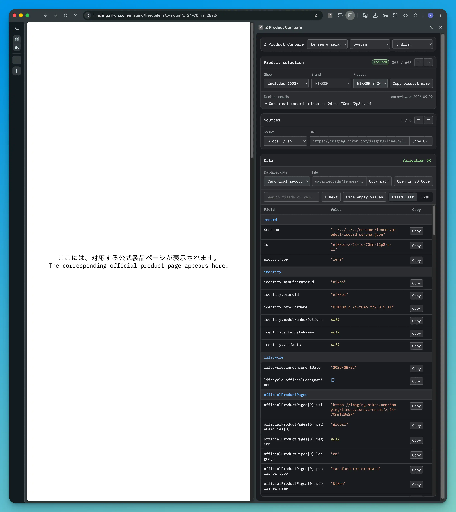

# 開発と検証

このページは、プロジェクトのデータや実装を変更し、生成と検証を行う開発者向けのガイドです。
データの変更に加え、JSON Schema、コード、ドキュメントの変更も対象とします。
このプロジェクトで初めて作業する場合は、[必要な開発環境](#development-environment)と[変更の基本手順](#workflow)を先に確認してください。
コマンド一覧以降は、作業内容に応じて参照できます。
配布データを利用するだけの場合は、[配布データを使う](use-data.md)を参照してください。

<div class="grid cards" markdown>

-   :material-check-decagram-outline:{ .lg .middle } **変更を検証する**

    ---

    ソースを修正し、生成ファイルの更新、リポジトリ検証、ドキュメントのビルドまでを順に実行します。

    [変更の基本手順](#workflow)

-   :material-book-open-page-variant:{ .lg .middle } **ドキュメントを確認する**

    ---

    日本語版と英語版をまとめて表示するか、編集中の言語だけを自動更新します。

    [ローカルでの確認方法](#docs-preview)

-   :material-compare-horizontal:{ .lg .middle } **製品情報を比較する**

    ---

    情報源を開いたまま、記録済みのデータとリポジトリ検証の結果を確認します。

    [Z Product Compareの使い方](#z-product-compare)

</div>

## 必要な開発環境 { #development-environment }

リポジトリをローカルに取得し、Python 3.14以降とHatchを利用できる状態にしてください。
このページのコマンドは、リポジトリのルートで実行してください。
初回の`hatch run`では、Hatchが必要な実行環境を自動的に作成します。

## 変更の基本手順 { #workflow }

変更対象のソースファイルを編集します。
変更内容に対応するJSONファイルは、[ファイルを直接編集する](contribute.md#direct-edit)で確認できます。

!!! warning "生成ファイルは直接編集しません"

    `dist/`にある三つの配布データと`PRODUCTS.md`は、収録製品データなどから自動生成されます。
    対応するソースファイルを修正してから、`hatch run generate`で更新してください。

変更後は、次の順序で整形からビルドまでを実行します。

```bash
hatch run format-json
hatch run generate
git diff -- dist PRODUCTS.md
hatch run check
hatch run docs:build
```

1. `format-json`で、リポジトリが管理するソースJSONを整形します。
2. `generate`で、三つの配布データと製品一覧を生成します。
3. `git diff`で、生成ファイルに意図した変更だけが含まれることを確認します。
4. `check`で、コード、ソースJSON、ライセンス、テスト、リポジトリ全体の整合性を検証します。
5. `docs:build`で、日本語版と英語版のドキュメントをビルドします。

生成処理は入力を先に検証し、三つの配布データと製品一覧を一時ファイルへ書き出してから置き換えます。
通常のエラーや割り込みが発生した場合は、それまでに置き換えたファイルを元の内容へ戻します。
OSやプロセスが強制終了して復元処理を実行できなかった場合は、`hatch run generate`を再実行して生成ファイルを揃えてください。

### 失敗した場合

`hatch run check`は複数の検証を順に実行し、最初の失敗で停止します。
エラーが出た箇所以降の検証は実行されません。
失敗箇所を修正した後に`check`全体を再実行してください。

| 停止した処理 | 最初に確認する箇所 |
| --- | --- |
| `format-json`または`generate` | エラーに示されたソースJSON、JSON Schema、設定。生成ファイルは直接修正しません。 |
| `check` | 最初に表示された失敗。個別コマンドで確認した場合も、修正後は`check`全体を再実行します。 |
| `docs:build` | 変更したMarkdown、リンク、Zensical設定。日本語版と英語版の両方を確認します。 |

すべての修正後に、[変更の基本手順](#workflow)の五つの操作を先頭から実行します。

## コマンド一覧

通常の変更では`hatch run check`を実行します。
失敗した検証だけを再実行したい場合は、対応する個別コマンドを使えます。

| コマンド | 役割 |
| --- | --- |
| `hatch run format-json` | `config/`、`data/`、`research/`、`schemas/`、`tools/`のソースJSONを整形する |
| `hatch run check-json-format` | ソースJSONの書式を変更せずに検査する |
| `hatch run generate` | レンズFull版、レンズLight版、マウントアダプターFull版、`PRODUCTS.md`を生成する |
| `hatch run validate` | JSON Schema自体、ファイル配置、ID、レジストリ参照、ファイル間の対応などをリポジトリ全体で検証する |
| `hatch run lint` | Pythonコードのlintと書式を検査する |
| `hatch run typecheck` | Pythonコードをmypyで型検査する |
| `hatch run test` | pytestのテストを実行する |
| `hatch run check` | JSON書式、ライセンス、Pythonコード、テスト、リポジトリ検証をまとめて実行する |
| `hatch run review` | `Z Product Compare`が使うローカルサーバーを起動する |
| `hatch run clean` | 生成ファイル、ビルド結果、キャッシュを削除する |
| `hatch run docs:serve` | 日本語版と英語版をまとめてビルドし、ローカルサーバーを起動する |
| `hatch run docs:serve-ja` | 日本語版を自動更新するローカルサーバーを起動する |
| `hatch run docs:serve-en` | 英語版を自動更新するローカルサーバーを起動する |
| `hatch run docs:build` | 日本語版と英語版の公開用サイトをビルドする |

リポジトリのJSON読込処理は、重複したオブジェクトキーと`NaN`、`Infinity`、`-Infinity`を拒否します。
この検査は、収録製品データだけでなく、調査結果、設定、JSON Schemaにも適用されます。

## ドキュメントをローカルで確認する { #docs-preview }

日本語版と英語版をまとめて確認する場合は、次のコマンドを実行します。

```bash
hatch run docs:serve
```

このコマンドは両言語のドキュメントをビルドし、英語版を`/`、日本語版を`/ja/`に配置します。
その後、ビルド結果を表示するローカルサーバーを起動します。
画面右上の言語切り替えも確認できます。
ローカルサーバーは`http://127.0.0.1:8766/`で起動します。

編集中のページを自動更新する場合は、対象言語のZensical開発サーバーを起動します。

```bash
hatch run docs:serve-ja
hatch run docs:serve-en
```

どちらの開発サーバーも`http://127.0.0.1:8766/`で起動します。

公開用のビルドは、次のコマンドで確認します。

```bash
hatch run docs:build
```

`docs:build`は、警告がある場合も失敗する公開環境と同じ設定で日本語版と英語版をビルドし、結果を`site/`に出力します。

## ドキュメントを変更する { #documentation-maintenance }

日英で対応する文書は、同じPull Requestで更新します。

| 対象 | 基準版と更新順 |
| --- | --- |
| `docs/ja/`と`docs/en/` | 日本語版を先に修正し、同じ相対パスの英語版を更新する |
| `README.md`と`README.ja.md`、`CONTRIBUTING.md`と`CONTRIBUTING.ja.md` | 英語版を先に修正し、日本語版を更新する |

両言語の説明内容、手順、コード例、リンクが一致していることを人が確認します。
`docs:build`はページ構成やリンクの問題を検出できますが、日英の内容が一致していることまでは検証しません。

## 情報源とデータを比較する { #z-product-compare }

`Z Product Compare`は、`hatch run review`でローカルサーバーを起動して使用します。
リポジトリには、ChromeおよびEdge向けの拡張機能が含まれています。
情報源をブラウザで開いたまま、記録済みのデータをサイドパネルに表示できます。
サイドパネルでは、調査結果データと収録製品データを切り替え、リポジトリ検証の結果も確認できます。
レンズと関連光学製品のデータセットと、マウントアダプターのデータセットに対応しています。

[](assets/images/z-product-compare.webp)

*Z Product Compareの画面例で、実際の利用時は左側に対応する公式製品ページが表示されます。*

### ローカルサーバーを起動する

リポジトリのルートで次のコマンドを実行します。

```bash
hatch run review
```

ローカルサーバーは`127.0.0.1:8765`で起動し、リポジトリ内のデータを読み取ります。
データは変更せず、ブラウザも自動では開きません。
調査中は、コマンドを実行したターミナルを開いたままにします。
表示内容はサーバー起動時のスナップショットです。
起動後にリポジトリ内のファイルを変更した場合は、サーバーを停止して`hatch run review`を再実行し、サイドパネルで再接続します。

### ChromeまたはEdgeに追加する

拡張機能の追加は、使用するブラウザごとに一度だけ必要です。

1. Chromeの`chrome://extensions`またはEdgeの`edge://extensions`を開きます。
2. デベロッパーモードを有効にします。
3. 「パッケージ化されていない拡張機能を読み込む」で`tools/z-product-compare-extension`を選びます。
4. 通常のWebページを開き、拡張機能メニューまたはツールバーから`Z Product Compare`を選びます。

サイドパネルがローカルサーバーへ接続できない場合は、起動コマンドと再接続ボタンが表示されます。

### 製品と情報源を選ぶ

画面上部で、レンズと関連光学製品のデータセット、またはマウントアダプターのデータセットを選びます。
表示対象は、「収録済み」「収録製品データなし」「要確認」「除外」「すべて」から選択できます。
続けてブランドと製品を選ぶと、収録判断、判断理由または未解決事項、最終確認日が表示されます。

製品または情報源を選ぶと、利用できる情報源が現在のタブに開きます。
情報源がない調査結果データでは`0 / 0`と表示され、現在のタブは移動しません。
製品選択欄の矢印ボタンまたは左右矢印キーを使うと、選択した表示対象の中で前後の製品へ移動できます。
情報源欄の矢印ボタンでは、同じ製品に記録された前後の情報源へ移動できます。

### 記録済みのデータを表示する

収録済みの製品では、収録製品データと調査結果データを切り替えられます。
収録製品データがない候補製品では、調査結果データを表示します。
データは、フィールド一覧またはJSONで表示できます。
空の値の表示とデータ内検索も利用できます。
画面には、現在のリポジトリ検証の結果も表示されます。

### VS Codeでデータを開く

`VS Codeで開く`を選ぶと、表示中の収録製品データまたは調査結果データをVS Codeで開き、製品名がある行へ移動します。
この操作にはVS Codeの`code`コマンドを使用します。
macOSで`code`が見つからない場合は、VS Codeのコマンドパレットから`Shell Command: Install 'code' command in PATH`を一度実行してください。

### 表示とキーボード操作

テーマは「システム設定」「ライト」「ダーク」から選べます。
「システム設定」は、OSとブラウザの設定に追従します。
表示言語は英語が初期値で、日本語へ切り替えられます。
テーマと言語の選択内容はブラウザに保存されます。

キーボードでは、`T`でフィールド一覧とJSON、`N`で空の値の表示を切り替えます。
データ内検索では、Enterキーで次の検索結果へ移動します。

### 拡張機能を使わずに開く

単独画面をブラウザで開く場合は、次のコマンドを実行します。

```bash
hatch run review --open
```

単独画面では、情報源のURLをコピーして別のタブで開きます。
サーバーのポートは`hatch run review --port 9000`のように変更できます。
拡張機能は既定ポート`8765`へ接続します。
別のポートを使う場合は、拡張機能ではなく単独画面を使用してください。

## 生成ファイルと環境を作り直す

生成ファイルとドキュメントのビルド結果を削除して作り直す場合は、次の順序で実行します。

```bash
hatch run clean
hatch run generate
hatch run docs:build
```

`clean`は`dist/`、`PRODUCTS.md`、`site/`、`build/`、各種キャッシュを削除します。
調査結果データ、収録製品データ、レジストリ、JSON Schema、設定は削除しません。
`clean`の直後は、Git上で`dist/`と`PRODUCTS.md`が削除された状態になります。
`generate`を実行すると、同じ入力から復元されます。

依存関係を含むHatch環境も作り直す場合は、次の順序で実行します。

```bash
hatch run clean
hatch env prune
hatch run generate
hatch run docs:build
```

`hatch env prune`は、このプロジェクトのHatch環境を削除します。
`clean`、`env prune`の順に実行してください。
先に`hatch env prune`を実行すると、その後の`hatch run clean`が`default`環境を再作成します。
次の`hatch run`で、必要な環境が自動的に再作成されます。

## JSON Schemaを変更する

JSON Schemaファイルを変更する場合は、[スキーマ変更時の互換性規則](use-data.md#schema-versioning)に従って新しい`schemaVersion`を決めます。
`config/versions.json`と、各JSON Schemaのバージョンを含む`$id`、固定値、参照を同じ版へ更新し、日英のJSON Schemaリファレンスと必要な移行説明も更新します。
その後、[変更の基本手順](#workflow)をすべて実行します。

公開済みのバージョン付きJSON Schemaは上書きも削除もしません。
変更が必要な場合は、新しい`schemaVersion`を使います。

## 関連ページ

- [製品情報の報告と編集](contribute.md)：変更するファイルとPull Requestの手順
- [調査結果データ](research.md)：収録判断、情報源、未解決事項の記録方法
- [データモデル](data-model.md)：調査結果データ、収録製品データ、配布データの関係
- [JSON Schemaリファレンス](reference/schemas/index.md)：型、必須項目、許可される値、条件付き制約
